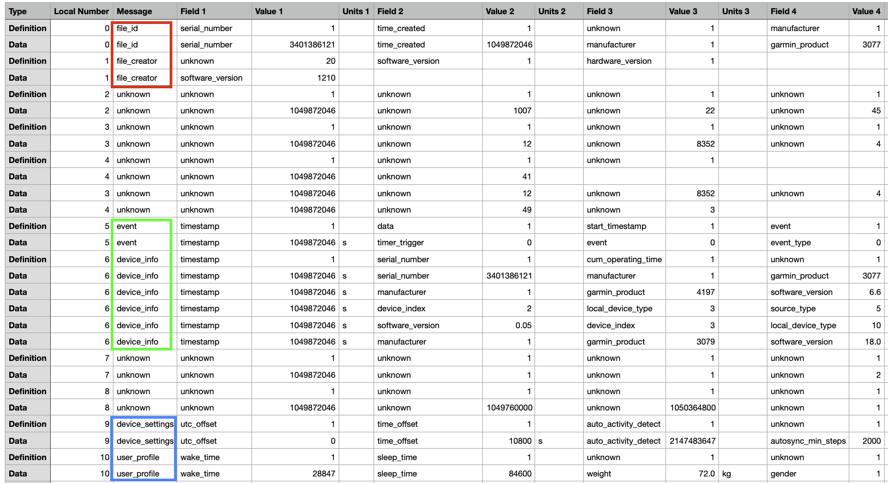
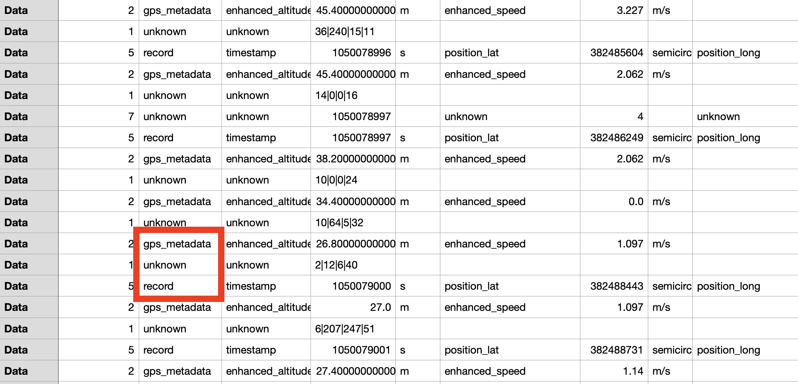

## Overview

**Garmin sent me the raw files from all the recordings made with my watch. My goal with these Python scripts is to preprocess about 1700 .csv files, making them ready for further analysis in areas like statistics, machine learning, etc.**

<br>

* I examine each data file in two steps due to the varying nature of the data . Initially, I analyze the top part, the first 20 rows, termed as the 'Head'. Subsequently, I focus on the remainder of the data, referred to as the 'Core'. The 'Core' typically contains more consistent and regular information.

<br>

### Head Assumptions
 
<br>

1. The initial rows in each file are mainly for setup and profiling, related to the device's software and user settings. These details are not crucial for analyzing running performance.

2. The 'Message' column provides early insights into the type of data but becomes less relevant for deeper analysis after the data categorization.

3. Columns like 'Type', 'Local Number', and 'Message' are generally redundant and not essential for the analysis.



### Core Assumptions:

<br>

1. Rows labeled 'record' include important features for this project, such as time, distance, pace, heart rate, etc.

2. 'unknown' or 'gps_metadata' rows seem to contain specific encoded information or initial GPS data, which is presumed to be included in the important features in the 'record' rows.

3. The 'unknown' rows might represent device-specific details or properties that are not directly relevant to performance analysis and can often be ignored.




## 🚀 Getting Started

<br>

1️⃣ Clone 🧙‍:
```shell
git clone git@github.com:EhrlichNati/Garmin-Sports-Watch-Data-Cleanup.git
cd Garmin-Sports-Watch-Data-Cleanup
```
2️⃣ Install Dependencies 📦:
```shell
python -m pip install -r requirements.txt
```
3️⃣ Let the reformatting Begin 😎:
```shell
python main.py
```

**Note:** the default folder paths are the one's directed to the 'Data' folder in the root project, you can change config.yml file as you wish.


<br><br><br><br><br><br><br><br><br><br><br><br><br><br><br><br>

### Functions General Description

**def run_clean(data_folder_path, processed_folder_path=False)**
  - **Purpose**: Manages the complete cleaning and processing workflow.
  - **Input**:
    - `data_folder_path`: Path to the folder with CSV files.
    - `processed_folder_path`: (Optional) Path for saving processed files.
  - **Output**: A fully processed DataFrame.

**def load_and_first_digest_data(path):**
  - **Purpose**: Loads a CSV file and conducts initial data cleansing.
  - **Input**: File path.
  - **Output**: DataFrame with records suitable for processing.

**def create_features_list(frame):**
  - **Purpose**: Determines and compiles a list of all features in the DataFrame.
  - **Input**: DataFrame.
  - **Output**: List of feature names.

**def transform_frame(frame, features_list):**
  - **Purpose**: Reformats the DataFrame into a structured layout.
  - **Input**: Original DataFrame and a list of features.
  - **Output**: Reorganized DataFrame.

**def imputation(frame):**
  - **Purpose**: Implements imputation techniques on the DataFrame.
  - **Input**: DataFrame.
  - **Output**: DataFrame with imputed data.
  - **Methods**:
    - KNN Imputation: Applied for columns like heart rate, cadence, and speed.
    - Custom Fill for Position: Imputes location and altitude based on nearest recorded values.
    - Distance Calculation: Estimates missing distance data using time and speed.

